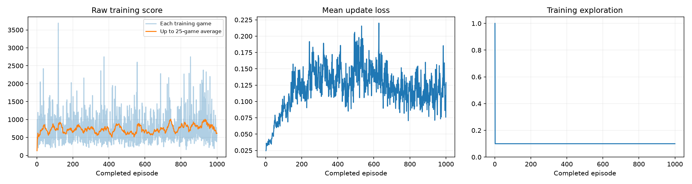
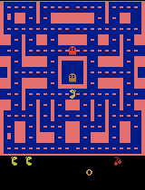
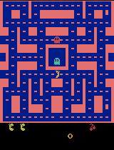

# Training a Ms. Pac-Man DQN agent

A Deep Q-Network (DQN) trained for 1,000 games of Atari Ms. Pac-Man on an Apple M4 laptop, using the class starter notebook ([pepealonso95/pacman-dqn](https://github.com/pepealonso95/pacman-dqn)). This README records my settings and reasons, what I expected, what happened, and what the agent actually learned.

**Result:** the trained agent's mean score over the five evaluation games was **534.0**, compared with **492.0** for the untrained network (+42.0). Three of the five games improved and two got worse, so this is a small, uncertain improvement rather than clear evidence of learning.

## Contents

- [How to run it](#how-to-run-it)
- [My three settings](#my-three-settings)
- [What I expected](#what-i-expected)
- [Training run](#training-run)
- [Before and after scores](#before-and-after-scores)
- [Training dashboard](#training-dashboard)
- [Gameplay](#gameplay)
- [How the agent works, in plain language](#how-the-agent-works-in-plain-language)
- [Limitation and next experiment](#limitation-and-next-experiment)
- [Evidence files](#evidence-files)

## How to run it

The executed notebook is [`pacman_dqn.ipynb`](pacman_dqn.ipynb). All cell outputs from the final run are saved in it, so you can read the results without rerunning anything.

**Locally (how this run was done).** The notebook needs Python 3.11–3.13; `ale-py` 0.11.2 has no Python 3.14 build.

```bash
uv venv --python 3.13
uv pip install -r requirements.txt pip
source .venv/bin/activate
jupyter lab pacman_dqn.ipynb
```

Then choose **Run All**. The notebook's saved kernel name (`py313`) won't exist on your machine, so if Jupyter asks, select **Python 3 (ipykernel)** from the activated environment. `pip` is installed explicitly because the notebook's setup cell uses `%pip`, and uv environments don't include pip by default.

This run was executed headlessly, which saves the same outputs into the notebook. The kernel flag selects the environment's own Python kernel; my run used an equivalent kernel registered from the same environment.

```bash
jupyter nbconvert --to notebook --execute pacman_dqn.ipynb --inplace --ExecutePreprocessor.kernel_name=python3 --ExecutePreprocessor.timeout=-1
```

**Google Colab.** [Open `pacman_dqn.ipynb` in Colab](https://colab.research.google.com/github/nolives/mspacman-agent/blob/main/pacman_dqn.ipynb), pick a GPU runtime if one is available, then choose **Runtime → Run all**.

Each run writes a new folder under `pacman_runs/` (ignored by git). The evidence from my run is copied into [`results/`](results).

## My three settings

| Setting | Value | Notebook default |
|---|---|---|
| Exploration | **0.10** | 0.20 |
| Episodes | **1,000** | 100 |
| Learning rate | **0.00025** | 0.0001 |

- **Exploration 0.10.** Exploration stays constant after the 1,000-decision warm-up, and the replay memory holds only about eight games of experience. Fewer random moves keep that small memory closer to how the agent actually plays. 0.1 is also the final exploration rate in the original DQN paper (Mnih et al., 2015), and evaluation uses 5% random moves.
- **Episodes 1,000.** More training games usually matter most for score. From a 5-episode setup check, I estimated 1,000 games would take about 2.5 hours on this laptop (it actually took 39 minutes). I stopped at 1,000 to keep training time reasonable.
- **Learning rate 0.00025.** This is the original DQN paper's learning rate. I seriously considered 0.0001 for steadier updates: big updates can overwrite good behavior late in a long run. The original paper used RMSProp, while this notebook uses Adam, so the same numerical learning rate does not imply equivalent updates. With a fixed 1,000-episode budget, I judged ending under-trained to be the bigger risk, so I chose the paper's value and accepted a higher chance of unstable updates.

**Other changes.** I set `SHOW_POPUPS = False`. This only disables the floating preview window; GIFs are still saved and shown inline, and training and evaluation are unaffected. I changed no other hyperparameters. Evaluation settings are unchanged: the same five seeds, 5% exploration, and 3,000-decision limit before and after training.

## What I expected

Before training I predicted a **modest improvement**: the trained mean would beat the untrained baseline, but not by much, because the replay memory is small (5,000 decisions) and exploration never decreases. My prediction and reasoning were written down before the final run started, in [`results/pre_training_notes.md`](results/pre_training_notes.md). The prediction was written at 17:05, the learning-rate section was finished at 17:56:38, and training started at 17:56:52.

**What happened:** the mean rose by 42 points (8.5%), which matches that prediction. The details below show it's too small and inconsistent to count as reliable proof of learning.

## Training run

| | |
|---|---|
| Status | **Completed** (not interrupted) |
| Completed episodes | 1,000 of 1,000 |
| Decisions | 604,639 |
| Learning updates | 150,910 |
| Training time | 38.8 minutes (39.1 minutes for the whole notebook) |
| Hardware | Apple M4 MacBook Air (10-core CPU, 16 GB), PyTorch on the Apple GPU (MPS) |
| Software | macOS 26.6.2, Python 3.13.15, torch 2.14.0, gymnasium 1.3.0, ale-py 0.11.2 |

Before the final run I ran a 5-episode setup check with the same exploration rate and learning rate. It isn't part of these results. With the same fixed seed, the final run reproduced that check's untrained scores and first five training games exactly.

## Before and after scores

The baseline is the **untrained network**, not a random-action agent. Both evaluations use the same five game seeds and 5% random moves.

| Game | Seed | Untrained | Trained | Change |
|---|---|---|---|---|
| 1 | 101 | 350 | 410 | +60 |
| 2 | 202 | 500 | 490 | -10 |
| 3 | 303 | 320 | 530 | +210 |
| 4 | 404 | 800 | 460 | -340 |
| 5 | 505 | 490 | 780 | +290 |
| **Mean** | | **492.0** | **534.0** | **+42.0** |

Full data: [`results/comparison.json`](results/comparison.json).

How to read this:
- **Three of five games improved; two got worse.** The untrained scores alone range from 320 to 800, so a 42-point difference in the mean can't be separated from that game-to-game noise.
- **The trained agent died sooner but scored faster.** Untrained games averaged 589 decisions and trained games 492, while points per decision rose from 0.84 to 1.08. That fits the reward: the agent is paid in points, not for staying alive.
- **No evaluation game reached the time limit,** before or after.

## Training dashboard



- **Training score:** mostly flat for about 700 games, then higher over the last 300. The average of each 100 games was between 677 and 760 through episode 700, then 773, 811, and 812. The first 100 games averaged 718 and the last 100 averaged 812. Training games include 10% random moves, so they aren't directly comparable to the evaluation scores.
- **Loss:** rose from about 0.06 to about 0.15 by the middle of training, then eased to about 0.12. Loss measures prediction error, not how well the agent plays, and it often rises in DQN as value estimates grow. Here the lower loss late in training coincided with slightly higher scores, but loss and score don't have to move together.
- **Exploration:** fully random for the 1,000-decision warm-up, then constant at 10%, as designed.

## Gameplay

Each GIF shows **only the first 20 seconds** of a game, sped up 4×. Scores cover the entire game.

| Untrained (seed 101) | Trained, best of five games (seed 505) | Trained, same game as untrained (seed 101) |
|---|---|---|
|  |  |  |
| 350 points, 560 decisions | 780 points, 514 decisions | 410 points, 490 decisions |

The first and third GIFs are the same game (seed 101) before and after training, so they're the fairest direct comparison. The middle GIF is the notebook's highlighted "best" game, chosen by full-game score.

**What I observed:**
- **Untrained:** Ms. Pac-Man eats pellets through the middle-left of the maze, then stalls for about 4 seconds in corridors she has already cleared. She never goes for a power pellet and loses a life at about 19 seconds.
- **Best trained game:** she loses a life at about 10 seconds, earlier than the untrained agent. After restarting, she heads for the bottom-left power pellet, but doesn't eat any of the blue ghosts in the clip. The GIF ends at 460 of the game's 780 points.
- **Progress snapshot at episode 975** (seed 101, below): she reaches a power pellet within about 7 seconds, clears most of the bottom half, and keeps all her lives through the first 20 seconds. She still ignores blue ghosts and still stalls in cleared corridors.

Learning was unstable from one snapshot to the next. On the same game (seed 101), the episode-975 snapshot scored 1,640, while the final model scored 410.

### Progress GIFs every 25 episodes

Every 25 training games, the notebook played one evaluation game on seed 101 and saved the first 20 seconds. Each is a single noisy game: these 40 scores range from 220 to 1,640, and 8 of them reached 1,000 or more. Scores are in [`results/demo_scores.json`](results/demo_scores.json).

<details>
<summary>Show all 40 progress GIFs</summary>

<table>
<tr><td align="center"><br>Episode 25<br>score 300</td><td align="center"><br>Episode 50<br>score 320</td><td align="center"><br>Episode 75<br>score 1,000</td><td align="center"><br>Episode 100<br>score 1,210</td><td align="center"><br>Episode 125<br>score 260</td></tr>
<tr><td align="center"><br>Episode 150<br>score 570</td><td align="center"><br>Episode 175<br>score 450</td><td align="center"><br>Episode 200<br>score 580</td><td align="center"><br>Episode 225<br>score 450</td><td align="center"><br>Episode 250<br>score 460</td></tr>
<tr><td align="center"><br>Episode 275<br>score 220</td><td align="center"><br>Episode 300<br>score 540</td><td align="center"><br>Episode 325<br>score 220</td><td align="center"><br>Episode 350<br>score 380</td><td align="center"><br>Episode 375<br>score 1,050</td></tr>
<tr><td align="center"><br>Episode 400<br>score 1,270</td><td align="center"><br>Episode 425<br>score 390</td><td align="center"><br>Episode 450<br>score 1,120</td><td align="center"><br>Episode 475<br>score 400</td><td align="center"><br>Episode 500<br>score 330</td></tr>
<tr><td align="center"><br>Episode 525<br>score 820</td><td align="center"><br>Episode 550<br>score 820</td><td align="center"><br>Episode 575<br>score 680</td><td align="center"><br>Episode 600<br>score 380</td><td align="center"><br>Episode 625<br>score 400</td></tr>
<tr><td align="center"><br>Episode 650<br>score 1,010</td><td align="center"><br>Episode 675<br>score 960</td><td align="center"><br>Episode 700<br>score 220</td><td align="center"><br>Episode 725<br>score 680</td><td align="center"><br>Episode 750<br>score 530</td></tr>
<tr><td align="center"><br>Episode 775<br>score 270</td><td align="center"><br>Episode 800<br>score 400</td><td align="center"><br>Episode 825<br>score 610</td><td align="center"><br>Episode 850<br>score 860</td><td align="center"><br>Episode 875<br>score 1,010</td></tr>
<tr><td align="center"><br>Episode 900<br>score 780</td><td align="center"><br>Episode 925<br>score 930</td><td align="center"><br>Episode 950<br>score 350</td><td align="center"><br>Episode 975<br>score 1,640</td><td align="center"><br>Episode 1000<br>score 410</td></tr>
</table>

</details>

## How the agent works, in plain language

- **Observations: four game screens.** The agent sees the last four frames, each shrunk to 84×84 grayscale pixels. One screen shows where things are; four in a row show which way they're moving. It has no other memory of the game.
- **Actions: joystick moves.** Every decision (four game frames), it picks one of 9 moves: no move, up, down, left, right, or one of four diagonals.
- **Rewards: game points.** The score from eating pellets, power pellets, fruit, and ghosts is its reward. For learning, each reward is clipped to between −1 and +1, so every scoring event counts about the same; all scores reported here are the real game scores.
- **Learning.** A convolutional neural network estimates how many future points each move will lead to, and the agent usually picks the move with the highest estimate (10% of the time it moves randomly to explore). It stores recent experience in a replay memory of 5,000 decisions and repeatedly learns from random batches of 32. A second, slower-changing copy of the network provides steady learning targets.

## Limitation and next experiment

**Observed limitation: the agent sometimes stalls in cleared corridors despite remaining pellets being visible.** In the GIFs, both the untrained and trained agents spend several seconds wandering corridors they have already cleared, even though the remaining pellets appear in the screens they observe. The agent has not learned reliable navigation toward those pellets. Its four-screen input provides only a short movement history.

**Next experiment: change only the learning rate, from 0.00025 to 0.0001,** keeping exploration at 0.10 and episodes at 1,000.

This assumes the replay memory stays at the notebook's fixed 5,000 decisions. If that setting could change, raising it to 50,000 decisions (about 80 games, roughly 1.6 GB of RAM) would be my first choice, because I think the small memory is the bigger bottleneck. Among my three settings, though, the learning rate targets what the evidence shows most clearly: **unstable learning**. The 40 progress games, all on the same seed, ranged from 220 to 1,640 points, and the episode-975 snapshot scored 1,640 where the final model scored 410. A smaller learning rate changes the network less with each batch, which may reduce those swings and make the final model more dependable. The risk is slower learning within 1,000 games. Comparing both runs' five evaluation scores, and how widely their progress scores vary, would show which effect wins.

## Evidence files

| File | Contents |
|---|---|
| [`pacman_dqn.ipynb`](pacman_dqn.ipynb) | Executed notebook with all outputs from the final run |
| [`results/config.json`](results/config.json) | All settings, hardware, and package versions |
| [`results/training.csv`](results/training.csv) | One row per training game: score, length, loss, elapsed time |
| [`results/training_summary.json`](results/training_summary.json) | Completion status, episodes, decisions, learning updates, time |
| [`results/comparison.json`](results/comparison.json) | All five untrained and trained evaluation scores |
| [`results/baseline.json`](results/baseline.json) | Untrained evaluation on its own |
| [`results/demo_scores.json`](results/demo_scores.json) | Scores of the 40 progress games |
| [`results/training_dashboard.png`](results/training_dashboard.png) | Score, loss, and exploration plots |
| [`results/demos/`](results/demos) | Untrained, 40 progress, and final GIFs |
| [`results/pre_training_notes.md`](results/pre_training_notes.md) | Settings, reasons, and prediction recorded before training |

**Model checkpoints are in a GitHub release, not in the repository files.** The run saved 42 checkpoints of about 6.7 MB each: the untrained network, one every 25 episodes, and the final model. The complete run folder, including every checkpoint, is zipped (264 MB) and attached to the [final-run release](https://github.com/nolives/mspacman-agent/releases/tag/final-run) as `20260914_175657_470699.zip`. Checkpoints store the network weights for playback; they can't resume training.
